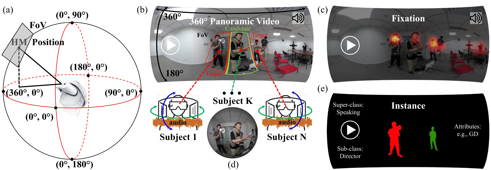
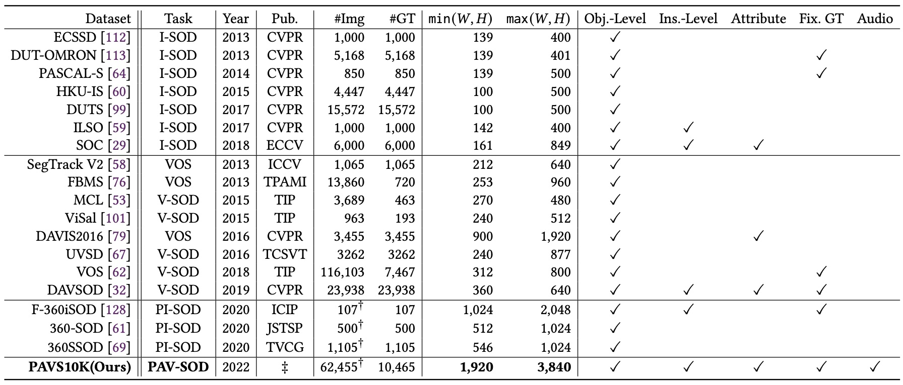
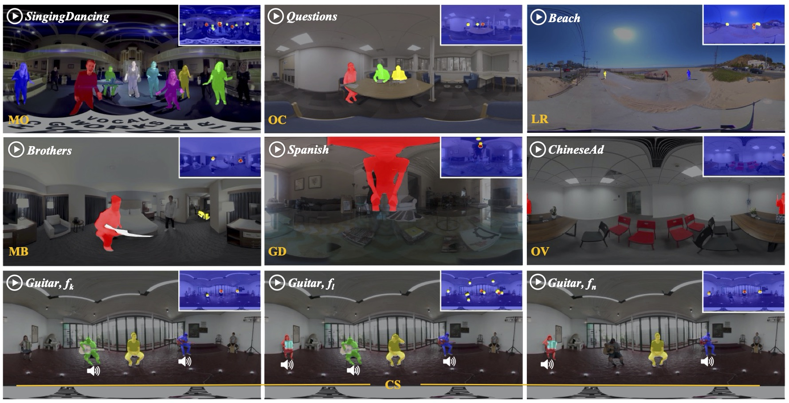
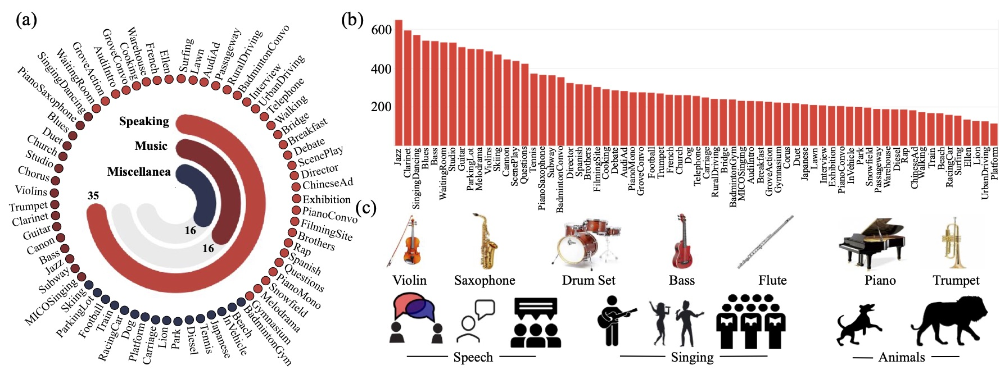

# [PAV-SOD: A New Task Towards Panoramic Audiovisual Saliency Detection (TOMM 2022)](https://dl.acm.org/doi/abs/10.1145/3565267)

Object-level audiovisual saliency detection in 360° panoramic real-life dynamic scenes is important for exploring and modeling human perception in immersive environments, also for aiding the development of virtual, augmented and mixed reality applications in the fields of such as education, social network, entertainment and training. To this end, we propose a new task, panoramic audiovisual salient object detection (PAV-SOD), which aims to segment the objects grasping most of the human attention in 360° panoramic videos reflecting real-life daily scenes. To support the task, we collect PAVS10K, the first panoramic video dataset for audiovisual salient object detection, which consists of 67 4K-resolution equirectangular videos with per-video labels including hierarchical scene categories and associated attributes depicting specific challenges for conducting PAV-SOD, and 10,465 uniformly sampled video frames with manually annotated object-level and instance-level pixel-wise masks. The coarse-to-fine annotations enable multi-perspective analysis regarding PAV-SOD modeling. We further systematically benchmark 13 state-of-the-art salient object detection (SOD)/video object segmentation (VOS) methods based on our PAVS10K. Besides, we propose a new baseline network, which takes advantage of both visual and audio cues of 360° video frames by using a new conditional variational auto-encoder (CVAE). Our CVAE-based audiovisual network, namely CAV-Net, consists of a spatial-temporal visual segmentation network, a convolutional audio-encoding network and audiovisual distribution estimation modules. As a result, our CAV-Net outperforms all competing models and is able to estimate the aleatoric uncertainties within PAVS10K. With extensive experimental results, we gain several findings about PAV-SOD challenges and insights towards PAV-SOD model interpretability. We hope that our work could serve as a starting point for advancing SOD towards immersive media.

------

# PAVS10K

      
    <em> 
    Figure 1: An example of our PAVS10K where coarse-to-fine annotations are provided, based on a guidance of fixations acquired from subjective experiments conducted by multiple (N) subjects wearing Head-Mounted Displays (HMDs) and headphones. Each (e.g., fk, fl and fn, where random integral values {k, l, n} ∈ [1, T ]) of the total equirectangular (ER) video frames T of the sequence “Speaking”(Super-class)-“Brothers”(sub-class) are manually labeled with both object-level and instance-level pixel-wise masks. According to the features of defined salient objects within each of the sequences, multiple attributes, e.g., “multiple objects” (MO), “competing sounds” (CS), “geometrical distortion” (GD), “motion blur” (MB), “occlusions” (OC) and “low resolution” (LR) are further annotated to enable detailed analysis for PAV-SOD modeling.
    </em>

      
    <em> 
    Figure 2: Summary of widely used salient object detection (SOD)/video object segmentation (VOS) datasets and PAVS10K. #Img: The number of images/video frames. #GT: The number of object-level pixel-wise masks (ground truth for SOD). Pub. = Publication. Obj.-Level = Object-Level Labels. Ins.-Level = Instance-Level Labels. Fix. GT = Fixation Maps. † denotes equirectangular images.
    </em>

      
    <em> 
    Figure 3: Examples of challenging attributes on equirectangular images from our PAVS10K, with instance-level ground truth and fixations as annotation guidance. {𝑓𝑘, 𝑓𝑙, 𝑓𝑛} denote random frames of a given video.
    </em>

      
    <em> 
    Figure 4: Statistics of the proposed PAVS10K. (a) Super-/sub-category information. (b) Instance density (labeled frames per sequence) of each sub-class. (c) Sound sources of PAVS10K scenes, such as musical instruments, human instances and animals.
    </em>

------

# Benchmark Models

**No.** | **Year** | **Pub.** | **Title** | **Links** 
:-: | :-:| :-: | :-  | :-: 
01 | **2019**| **CVPR** | Cascaded Partial Decoder for Fast and Accurate Salient Object Detection | [Paper](https://openaccess.thecvf.com/content_CVPR_2019/papers/Wu_Cascaded_Partial_Decoder_for_Fast_and_Accurate_Salient_Object_Detection_CVPR_2019_paper.pdf)/[Code](https://github.com/wuzhe71/CPD) 
02 | **2019**| **CVPR** | See More, Know More: Unsupervised Video Object Segmentation with Co-Attention Siamese Networks | [Paper](https://openaccess.thecvf.com/content_CVPR_2019/papers/Lu_See_More_Know_More_Unsupervised_Video_Object_Segmentation_With_Co-Attention_CVPR_2019_paper.pdf)/[Code](https://github.com/carrierlxk/COSNet) 
03 | **2019**| **ICCV** | Stacked Cross Refinement Network for Edge-Aware Salient Object Detection | [Paper](https://openaccess.thecvf.com/content_ICCV_2019/papers/Wu_Stacked_Cross_Refinement_Network_for_Edge-Aware_Salient_Object_Detection_ICCV_2019_paper.pdf)/[Code](https://github.com/wuzhe71/SCRN)
04 | **2019**| **ICCV** | Semi-Supervised Video Salient Object Detection Using Pseudo-Labels | [Paper](https://openaccess.thecvf.com/content_ICCV_2019/papers/Yan_Semi-Supervised_Video_Salient_Object_Detection_Using_Pseudo-Labels_ICCV_2019_paper.pdf)/[Code](https://github.com/Kinpzz/RCRNet-Pytorch)
05 | **2020**| **AAAI** | F³Net: Fusion, Feedback and Focus for Salient Object Detection | [Paper](https://ojs.aaai.org/index.php/AAAI/article/download/6916/6770)/[Code](https://github.com/weijun88/F3Net)
06 | **2020**| **AAAI** | Pyramid Constrained Self-Attention Network for Fast Video Salient Object Detection | [Paper](https://ojs.aaai.org/index.php/AAAI/article/view/6718/6572)/[Code](https://github.com/guyuchao/PyramidCSA)
07 | **2020**| **CVPR** | Multi-scale Interactive Network for Salient Object Detection | [Paper](https://openaccess.thecvf.com/content_CVPR_2020/papers/Pang_Multi-Scale_Interactive_Network_for_Salient_Object_Detection_CVPR_2020_paper.pdf)/[Code](https://github.com/lartpang/MINet)
08 | **2020**| **CVPR** | Label Decoupling Framework for Salient Object Detection | [Paper](https://openaccess.thecvf.com/content_CVPR_2020/papers/Wei_Label_Decoupling_Framework_for_Salient_Object_Detection_CVPR_2020_paper.pdf)/[Code](https://github.com/weijun88/LDF)
09 | **2020**| **ECCV** | Highly Efficient Salient Object Detection with 100K Parameters | [Paper](http://mftp.mmcheng.net/Papers/20EccvSal100k.pdf)/[Code](https://github.com/ShangHua-Gao/SOD100K)
10 | **2020**| **ECCV** | Suppress and Balance: A Simple Gated Network for Salient Object Detection | [Paper](https://www.ecva.net/papers/eccv_2020/papers_ECCV/papers/123470035.pdf)/[Code](https://github.com/Xiaoqi-Zhao-DLUT/GateNet-RGB-Saliency)
11 | **2020**| **BMVC** | Making a Case for 3D Convolutions for Object Segmentation in Videos | [Paper](https://www.bmvc2020-conference.com/assets/papers/0233.pdf)/[Code](https://github.com/sabarim/3DC-Seg)
12 | **2020**| **SPL** | FANet: Features Adaptation Network for 360° Omnidirectional Salient Object Detection | [Paper](https://ieeexplore.ieee.org/document/9211754)/[Code](https://github.com/DreaMKHuang/FANet)
13 | **2021**| **CVPR** | Reciprocal Transformations for Unsupervised Video Object Segmentation | [Paper](https://openaccess.thecvf.com/content/CVPR2021/papers/Ren_Reciprocal_Transformations_for_Unsupervised_Video_Object_Segmentation_CVPR_2021_paper.pdf)/[Code](https://github.com/OliverRensu/RTNet)

------

# CAV-Net

The codes are available at [src](https://github.com/PanoAsh/PAV-SOD/tree/main/src).

The pre-trained models can be downloaded at [Google Drive](https://drive.google.com/file/d/1gNWmgmlBfJqCYE5phDuHTMFIou1TAmXs/view?usp=sharing).

------

# Dataset Downloads

The whole object-/instance-level ground truth with default split can be downloaded from [Google Drive](https://drive.google.com/file/d/1Whp_ftuXza8-vkjNtICdxdRebcmzcrFi/view?usp=sharing).

The videos (with ambisonics) with default split can be downloaded from [Google Drive](https://drive.google.com/file/d/13FEv1yAyMmK4GkiZ2Mce6gJxQuME7vG3/view?usp=sharing). 

The head movement and eye fixation data can be downloaded from [Google Drive](https://drive.google.com/drive/folders/1tZDIESRiy3W2g--8lnNWag3KhpEGqTHc?usp=sharing)

To generate video frames, please refer to [video_to_frames.py](https://github.com/PanoAsh/ASOD60K/blob/main/video_to_frames.py).

To get access to raw videos on YouTube, please refer to [video_seq_link](https://github.com/PanoAsh/ASOD60K/blob/main/video_seq_link). 

> Note: The PAVS10K dataset does not own the copyright of videos. Only researchers and educators who wish to use the videos for non-commercial researches and/or educational purposes, have access to PAVS10K.

------

# Citation
    
    @article{zhang2022pav,
      title={PAV-SOD: A New Task Towards Panoramic Audiovisual Saliency Detection},
      author={Zhang, Yi and Chao, Fang-Yi and Hamidouche, Wassim and Deforges, Olivier},
      journal={ACM Transactions on Multimedia Computing, Communications, and Applications (TOMM)},
      year={2022},
      publisher={ACM New York, NY}
    }

------

# Contact

yi23zhang.2022@gmail.com
or 
fangyichao428@gmail.com (for details of head movement and eye fixation data).
