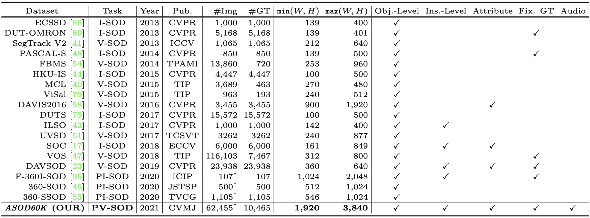
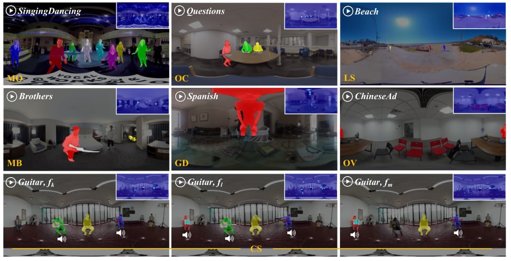
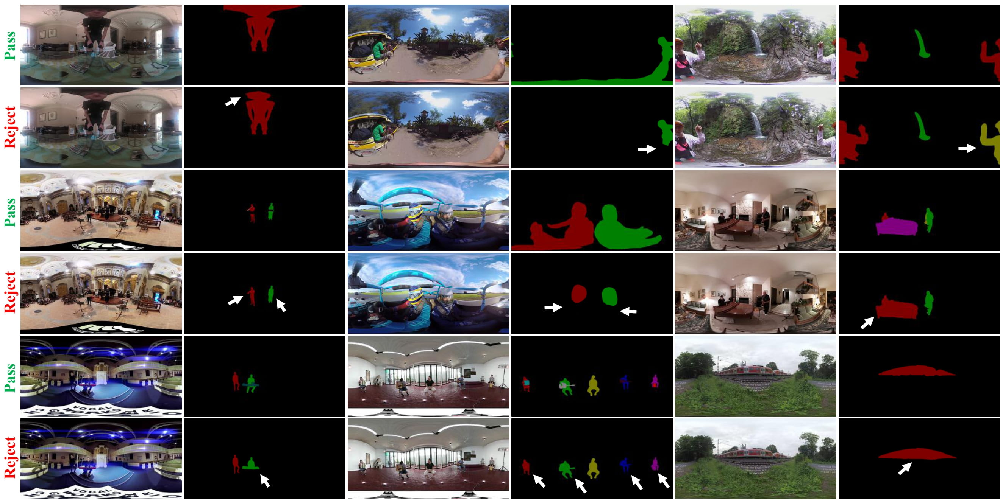
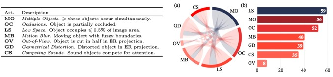
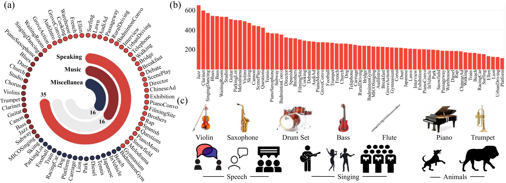
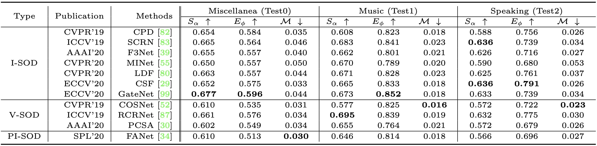
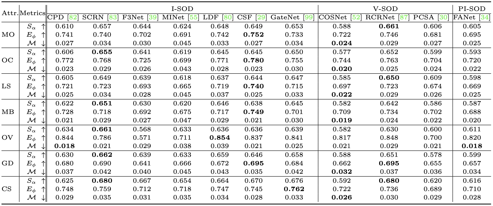

# [ASOD60K:Audio-Induced Salient Object Detection in Panoramic Videos](https://arxiv.org/abs/2107.11629) 

Authors: [*Yi Zhang*](https://www.linkedin.com/in/bill-y-zhang/), [*Fang-Yi Chao*](https://scholar.google.com/citations?hl=en&user=C9vR9EwAAAAJ), [*Ge-Peng Ji*](https://scholar.google.com/citations?user=oaxKYKUAAAAJ&hl=en), [*Deng-Ping Fan*](https://dpfan.net/), [*Lu Zhang*](https://luzhang.perso.insa-rennes.fr/), [*Ling Shao*](https://scholar.google.com/citations?user=z84rLjoAAAAJ&hl=en).

# Introduction

      
    <em> 
    Figure 1: Annotation examples from the proposed ASOD60K dataset. (a) Illustration of head movement (HM). The subjects wear Head-Mounted Displays (HMDs) and observe 360° scenes by moving their head to control a field-of-view (FoV) in the range of 360°×180°. (b) Each subject (i.e., Subject 1 to Subject N) watches the video without restriction. (c) The HMD-embedded eye tracker records their eye fixations. (d) According to the fixations, we provide coarse-to-fine annotations for each FoV including (e) super/sub-classes, instance-level masks and attributes (e.g., GD-Geometrical Distortion).
    </em>

Exploring to what humans pay attention in dynamic panoramic scenes is useful for many fundamental applications, including augmented reality (AR) in retail, AR-powered recruitment, and visual language navigation. With this goal in mind, we propose PV-SOD, a new task that aims to segment salient objects from panoramic videos. In contrast to existing fixation-level or object-level saliency detection tasks, we focus on multi-modal salient object detection (SOD), which mimics human attention mechanism by segmenting salient objects with the guidance of audio-visual cues. To support this task, we collect the first large-scale dataset, named ASOD60K, which contains 4K-resolution video frames annotated with a six-level hierarchy, thus distinguishing itself with richness, diversity and quality. Specifically, each sequence is marked with both its super-/sub-class, with objects of each sub-class being further annotated with human eye fixations, bounding boxes, object-/instance-level masks, and associated attributes (e.g., geometrical distortion). These coarse-to-fine annotations enable detailed analysis for PV-SOD modeling, e.g., determining the major challenges for existing SOD models, and predicting scanpaths to study the long-term eye fixation behaviors of humans. We systematically benchmark 11 representative approaches on ASOD60K and derive several interesting findings. We hope this study could serve as a good starting point for advancing SOD research towards panoramic videos. 

:running: :running: :running: ***KEEP UPDATING***.

------

# Related Dataset Works

      
    <em> 
    Figure 2: Summary of widely used salient object detection (SOD) datasets and the proposed panoramic video SOD (PV-SOD) dataset. #Img: The number of images/frames. #GT: The number of ground-truth masks. Pub. = Publication. Obj.-Level = Object-Level. Ins.-Level = Instance-Level. Fix.GT = Fixation-guided ground truths. † denotes equirectangular (ER) images.
    </em>

------

# Dataset Annotations and Attributes

      
    <em> 
    Figure 3: Examples of challenging attributes on equirectangular (ER) images from our ASOD60K, with instance-level GT and fixations as annotation guidance. f(k,l,m) denote random frames of a given video.
    </em>

      
    <em> 
    Figure 4: More annotations. Passed and rejected examples of annotation quality control.
    </em>

      
    <em> 
    Figure 5: Attributes description and stastistics. (a)/(b) represent the correlation and frequency of ASOD60K’s attributes, respectively.
    </em>

# Dataset Statistics 

      
    <em> 
    Figure 6: Statistics of the proposed ASOD60K. (a) Super-/sub-category information. (b) Instance density of each sub-class. (c) Main components of ASOD60K scenes.
    </em>

------

# Benchmark

## Overall Quantitative Results

      
    <em> 
    Figure 7: Performance comparison of 7/3 state-of-the-art conventional I-SOD/V-SOD methods and one PI-SOD method over ASOD60K. ↑/↓ denotes a larger/smaller value is better. Best result of each column is bolded.
    </em>

## Attributes-Specific Quantitative Results

      
    <em> 
    Figure 8: Performance comparison of 7/3/1 state-of-the-art I-SOD/V-SOD/PI-SOD methods based on each of the attributes.
    </em>

## Reference

**No.** | **Year** | **Pub.** | **Title** | **Links** 
:-: | :-: | :-: | :-  | :-: 
01 | 2019 | IEEE CVPR   |  Cascaded Partial Decoder for Fast and Accurate Salient Object Detection | [Paper](https://openaccess.thecvf.com/content_CVPR_2019/papers/Wu_Cascaded_Partial_Decoder_for_Fast_and_Accurate_Salient_Object_Detection_CVPR_2019_paper.pdf)/[Project](https://github.com/wuzhe71/CPD)
02 | 2019 | IEEE ICCV |  Stacked Cross Refinement Network for Edge-Aware Salient Object Detection | [Paper](https://openaccess.thecvf.com/content_ICCV_2019/papers/Wu_Stacked_Cross_Refinement_Network_for_Edge-Aware_Salient_Object_Detection_ICCV_2019_paper.pdf)/[Project](https://github.com/wuzhe71/SCRN)
03 | 2020 | AAAI   |  F3Net: Fusion, Feedback and Focus for Salient Object Detection | [Paper](https://arxiv.org/pdf/1911.11445.pdf)/[Project](https://github.com/weijun88/F3Net)
04 | 2020 | IEEE CVPR  |  Multi-scale Interactive Network for Salient Object Detection | [Paper](https://openaccess.thecvf.com/content_CVPR_2020/papers/Pang_Multi-Scale_Interactive_Network_for_Salient_Object_Detection_CVPR_2020_paper.pdf)/[Project](https://github.com/lartpang/MINet)
05 | 2020 | IEEE CVPR |  Label Decoupling Framework for Salient Object Detection | [Paper](https://openaccess.thecvf.com/content_CVPR_2020/papers/Wei_Label_Decoupling_Framework_for_Salient_Object_Detection_CVPR_2020_paper.pdf)/[Project](https://github.com/weijun88/LDF)
06 | 2020 | ECCV       |  Highly Efficient Salient Object Detection with 100K Parameters | [Paper](https://www.ecva.net/papers/eccv_2020/papers_ECCV/papers/123510698.pdf)/[Project](https://github.com/ShangHua-Gao/SOD100K)
07 | 2020 | ECCV       |  Suppress and Balance: A Simple Gated Network for Salient Object Detection | [Paper](https://www.ecva.net/papers/eccv_2020/papers_ECCV/papers/123470035.pdf)/[Project](https://github.com/Xiaoqi-Zhao-DLUT/GateNet-RGB-Saliency)
08 | 2019 | IEEE CVPR |  See More, Know More: Unsupervised Video Object Segmentation with Co-Attention Siamese Networks | [Paper](https://openaccess.thecvf.com/content_CVPR_2019/papers/Lu_See_More_Know_More_Unsupervised_Video_Object_Segmentation_With_Co-Attention_CVPR_2019_paper.pdf)/[Project](https://github.com/carrierlxk/COSNet)
09 | 2019 | IEEE ICCV |  Semi-Supervised Video Salient Object Detection Using Pseudo-Labels | [Paper](https://openaccess.thecvf.com/content_ICCV_2019/papers/Yan_Semi-Supervised_Video_Salient_Object_Detection_Using_Pseudo-Labels_ICCV_2019_paper.pdf)/[Project](https://github.com/Kinpzz/RCRNet-Pytorch) 
10 | 2020 | AAAI     |  Pyramid Constrained Self-Attention Network for Fast Video Salient Object Detection | [Paper](http://mftp.mmcheng.net/Papers/20AAAI-PCSA.pdf)/[Project](https://github.com/guyuchao/PyramidCSA) 
11 | 2020 | IEEE SPL     |  FANet: Features Adaptation Network for 360° Omnidirectional Salient Object Detection | [Paper](https://ieeexplore.ieee.org/abstract/document/9211754)/[Project](https://github.com/DreaMKHuang/FANet) 

------

# Evaluation Toolbox

All the quantitative results were computed based on one-key Python toolbox: https://github.com/zzhanghub/eval-co-sod .

------

# Downloads

The whole object-/instance-level ground truth with default split can be downloaded from [Baidu Dirve](https://pan.baidu.com/s/1zDXE9iHGyWZFFUDIeaKIdQ)(k3h8) or [Google Drive](https://drive.google.com/file/d/1SjsYz57gArBVr_yzgcRnqYI4MpDiZ_Fh/view?usp=sharing).

The videos with default split can be downloaded from [Google Drive](https://drive.google.com/file/d/1qYnXwKLZUtn4Gb8R9U5P4qsibUCNGoUN/view?usp=sharing) or [OneDrive](https://1drv.ms/u/s!Ais1kZo7RR7Lg1Vt1cA_M05apzL7?e=PzZ4Va). 

The head movement and eye fixation data can be downloaded from [Google Drive](https://drive.google.com/drive/folders/1tZDIESRiy3W2g--8lnNWag3KhpEGqTHc?usp=sharing)

To generate video frames, please refer to [video_to_frames.py](https://github.com/PanoAsh/ASOD60K/blob/main/video_to_frames.py).

To get access to raw videos on YouTube, please refer to [video_seq_link](https://github.com/PanoAsh/ASOD60K/blob/main/video_seq_link). 

To check basic information regarding the raw videos, please refer to [video_information.txt](https://github.com/PanoAsh/ASOD60K/blob/main/video_information.txt) (keep updating).

------

# Contact

Please feel free to drop an e-mail to yi.zhang1@insa-rennes.fr for questions or further discussion. 

If you have any question on head movement and eye fixation data, please contact fang-yi.chao@tcd.ie

------

# Citation

    @article{zhang2021asod60k,
      title={ASOD60K: Audio-Induced Salient Object Detection in Panoramic Videos},
      author={Zhang, Yi and Chao, Fang-Yi and Ji, Ge-Peng and Fan, Deng-Ping and Zhang, Lu and Shao, Ling},
      journal={arXiv preprint arXiv:2107.11629},
      year={2021}
    }
