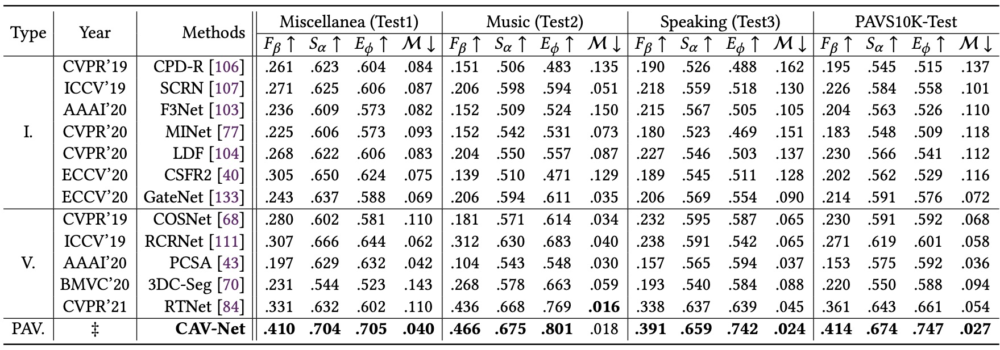
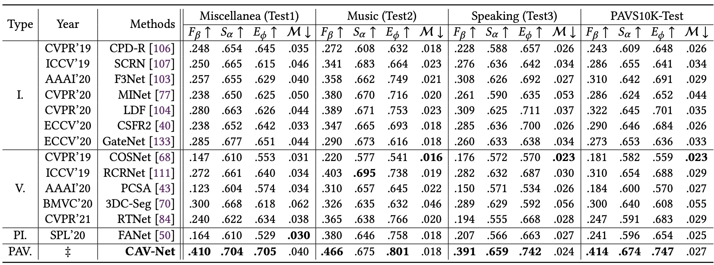
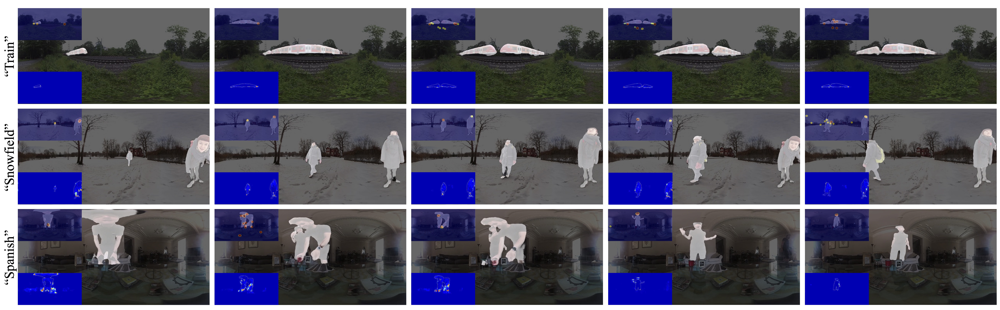

# Panoramic Audiovisual Salient Object Detection (PAV-SOD) 

PDF coming soon...

# Introduction

      
    <em> 
    Figure 1: An example of our PAVS10K where coarse-to-fine annotations are provided, based on a guidance of fixations acquired from subjective experiments conducted by multiple (N) subjects wearing Head-Mounted Displays (HMDs) and headphones. Each (e.g., fk, fl and fn, where random integral values {k, l, n} ∈ [1, T ]) of the total equirectangular (ER) video frames T of the sequence “Speaking”(Super-class)-“Brothers”(sub-class) are manually labeled with both object-level and instance-level pixel-wise masks. According to the features of defined salient objects within each of the sequences, multiple attributes, e.g., “multiple objects” (MO), “competing sounds” (CS), “geometrical distortion” (GD), “motion blur” (MB), “occlusions” (OC) and “low resolution” (LR) are further annotated to enable detailed analysis for PAV-SOD modeling.
    </em>

Object-level audiovisual saliency detection in 360° panoramic real-life dynamic scenes is important for exploring and modeling human perception in immersive environments, also for aiding the development of virtual, augmented and mixed reality applications in the fields of such as education, social network, entertainment and training. To this end, we propose a new task, panoramic audiovisual salient object detection (PAV-SOD), which aims to segment the objects grasping most of the human attention in 360° panoramic videos reflecting real-life daily scenes. To support the task, we collect PAVS10K, the first panoramic video dataset for audiovisual salient object detection, which consists of 67 4K-resolution equirectangular videos with per-video labels including hierarchical scene categories and associated attributes depicting specific challenges for conducting PAV-SOD, and 10,465 uniformly sampled video frames with manually annotated object-level and instance-level pixel-wise masks. The coarse-to-fine annotations enable multi-perspective analysis regarding PAV-SOD modeling. We further systematically benchmark 13 state-of-the-art salient object detection (SOD)/video object segmentation (VOS) methods based on our PAVS10K. Besides, we propose a new baseline model, i.e., CAV-Net, which takes advantage of both visual and audio cues of 360 video frames by using a new conditional variational auto-encoder. As a result, our CAV-Net outperforms all competing models and is able to represent the data bias within PAVS10K via uncertainty estimation. With extensive experimental results, we gain several findings about PAV-SOD challenges and insights towards PAV-SOD model interpretability. We hope that our work could serve as a starting point for advancing SOD towards immersive media.

:running: :running: :running: ***KEEP UPDATING***.

------

# PAVS10K

      
    <em> 
    Figure 2: Summary of widely used salient object detection (SOD)/video object segmentation (VOS) datasets and the proposed panoramic audiovisual SOD (PAV-SOD) dataset. #Img: The number of images/video frames. #GT: The number of object-level pixel-wise masks (ground truth for SOD). Pub. = Publication. Obj.-Level = Object-Level Labels. Ins.-Level = Instance-Level Labels. Fix. GT = Fixation Maps. † denotes equirectangular images.
    </em>

      
    <em> 
    Figure 3: Examples of challenging attributes on equirectangular images from our PAVS10K, with instance-level ground truth and fixations as annotation guidance. {𝑓𝑘, 𝑓𝑙, 𝑓𝑛} denote random frames of a given video.
    </em>

      
    <em> 
    Figure 4: Statistics of the proposed PAVS10K. (a) Super-/sub-category information. (b) Instance density (labeled frames per sequence) of each sub-class. (c) Sound sources of PAVS10K scenes, such as musical instruments, human instances and animals.
    </em>

------

# CAV-Net

For source codes please contact yi.panoash@gmail.com .

------

# Performance

      
    <em> 
    Figure 6: Performance comparison of our panoramic audiovisual network, i.e., CAV-Net and 12 state-of-the-art SOD/VOS methods without training on PAVS10K. I. = I-SOD. V. = V-SOD/VOS. Best result of each column is bolded.
    </em>

      
    <em> 
    Figure 7: Performance comparison between our CAV-Net and 13 state-of-the-art methods (including seven I-SOD (I.), five V-SOD/VOS (V.) and one 360° panoramic I-SOD (PI.) methods) with PAVS10K training.
    </em>

      
    <em> 
    Figure 8: Visual results of our CAV-Net on random frames of sequences (e.g., “Train”, “Snowfield” and “Spanish”), from the testing set of PAVS10K. On each frame, our CAV-Net is able to finely segment the salient objects strictly defined by fixations (left top), as well as predict uncertainty maps (left bottom) highlighting the challenging regions.
    </em>

------

# Downloads

The whole object-/instance-level ground truth with default split can be downloaded from [Google Drive](https://drive.google.com/file/d/1knE8yWklzyoFZqy_T5IlWlyNDnhUTwVl/view?usp=sharing).

The videos (with ambisonics) with default split can be downloaded from [Google Drive](https://drive.google.com/file/d/1sMRePuHBrQyXACqlgzIz7aKzy6qV5HaP/view?usp=sharing). 

The head movement and eye fixation data can be downloaded from [Google Drive](https://drive.google.com/drive/folders/1tZDIESRiy3W2g--8lnNWag3KhpEGqTHc?usp=sharing)

To generate video frames, please refer to [video_to_frames.py](https://github.com/PanoAsh/ASOD60K/blob/main/video_to_frames.py).

To get access to raw videos on YouTube, please refer to [video_seq_link](https://github.com/PanoAsh/ASOD60K/blob/main/video_seq_link). 

To check basic information regarding the raw videos, please refer to [video_information.txt](https://github.com/PanoAsh/ASOD60K/blob/main/video_information.txt) (keep updating).

------

# Contact

yi.panoash@gmail.com 
or 
fang-yi.chao@tcd.ie (for details of head movement and eye fixation data).
